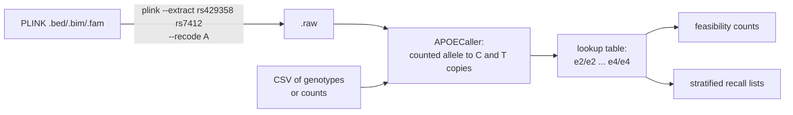

# APOE Genotyping Toolkit

[](https://github.com/dsugurtuna/apoe-genotyping-toolkit/actions/workflows/ci.yml)

Call APOE genotypes (e2/e3/e4) from rs429358 and rs7412, count how many genotyped participants meet a study's criteria, and build recall lists balanced by e4 status, sex and age band.

> **Portfolio disclaimer:** This repository contains sanitised, generalised versions of tooling developed during the author's tenure at NIHR BioResource. No real patient data, internal infrastructure paths, or participant identifiers are included. All examples use synthetic data.

---

## Why This Matters

The APOE gene is the strongest known genetic risk factor for late-onset Alzheimer's disease. Accurately determining a participant's genotype (e.g. e3/e4 vs e3/e3) is critical for:

- **Clinical trials** — stratifying patients by risk profile (e.g. feasibility screening for a pharmaceutical sponsor's Alzheimer's disease trial).
- **Recall studies** — generating balanced cohorts, for example 800 participants split by APOE e4 carrier status, gender, and age band.
- **GWAS preparation** — adjusting for APOE as a covariate in genome-wide association studies.
- **Precision medicine** — tailoring interventions based on genetic susceptibility.

## What this does

| Module | What it does |
|---|---|
| **APOECaller** | Resolves the six common APOE genotypes from rs429358 and rs7412. Reads PLINK `--recode A` (`.raw`, using the counted allele in each column name), PLINK compound-genotype `.ped`, and CSV/TSV with genotype strings (`TT`, `C/T`) or allele counts. |
| **APOEFeasibilityEstimator** | Counts genotyped participants whose genotype is in a target set, after exclusions, with a Wilson interval for the eligibility rate. |
| **CohortStratifier** | Builds female and male recall lists with a set share of e4 carriers, spread across age bands, optionally excluding e2 carriers. |
| **CLI** | `call`, `feasibility` and `stratify` sub-commands. |

## Genotype Mapping Logic

| rs429358 (codon 112) | rs7412 (codon 158) | APOE Genotype | Risk Profile |
|---|---|---|---|
| T/T | T/T | e2/e2 | Reduced risk |
| T/T | C/T | e2/e3 | Reduced risk |
| T/T | C/C | e3/e3 | Population baseline |
| C/T | C/T | e2/e4 | Uncertain / mixed |
| C/T | C/C | e3/e4 | Increased risk |
| C/C | C/C | e4/e4 | Substantially increased risk |

## How it works



For a `.raw` file, PLINK names each column `<SNP>_<counted allele>`. The caller converts the count to copies of C at rs429358 and T at rs7412 and looks the pair up in the table above. A C/T SNP reported as A/G (the reverse strand) is refused rather than guessed.

## Quick Start

### Installation

```bash
git clone https://github.com/dsugurtuna/apoe-genotyping-toolkit.git
cd apoe-genotyping-toolkit
python3.11 -m venv .venv && source .venv/bin/activate
pip install -e ".[dev]"
pytest
```

### Command-Line Usage

**Call genotypes from a CSV:**
```bash
apoe-toolkit call --input data/example/example_dosages.csv --format csv --summary
```

**Count participants with target genotypes (with a 95% Wilson interval):**
```bash
apoe-toolkit feasibility --input data/example/example_dosages.csv --targets e4/e4 e3/e4
```

**Generate stratified recall lists:**
```bash
apoe-toolkit stratify \
    --input data/example/example_cohort.csv \
    --study "STUDY-A" \
    --females 600 --males 200 \
    --output-dir recall_output/
```

### Python API

The file names in this example are placeholders for your own data.

```python
from apoe_toolkit import APOECaller, APOEFeasibilityEstimator, CohortStratifier

# Call genotypes
caller = APOECaller()
results = caller.call_from_csv("genotypes.csv", sample_col="IID")
summary = caller.summarise(results)

# Feasibility
estimator = APOEFeasibilityEstimator()
report = estimator.estimate_from_results(results, target_genotypes=["e3/e4", "e4/e4"])
print(estimator.format_report(report))

# Stratification
import pandas as pd
from apoe_toolkit.stratifier import StratificationConfig

cohort = pd.read_csv("cohort.csv")
config = StratificationConfig(
    study_name="STUDY-A",
    target_female_count=600,
    target_male_count=200,
    exclude_e2_carriers=True,
)
stratifier = CohortStratifier()
result = stratifier.stratify(cohort, config)
stratifier.export_recall_lists(result, "recall_output/")
```

### Docker

```bash
docker build -t apoe-toolkit .
docker run --rm -v "$PWD/data:/data" apoe-toolkit call --input /data/example/example_dosages.csv --format csv
```

## Legacy Scripts

The original Bash/Python pipeline scripts are preserved under the `legacy/` directory for reference. These were designed for HPC (SLURM) environments and rely on PLINK 1.9 for genotype extraction before passing data to the Python caller. They are not maintained or linted.

## Testing

```bash
make test        # pytest
make lint        # ruff check, ruff format --check, mypy --strict
```

## Design decisions

- **Read the counted allele, do not assume it.** PLINK counts its A1 allele, which is usually the minor allele (C at rs429358, T at rs7412) but can differ, for example after `--keep-allele-order` or in an e4-enriched sample. Reading it from the column name removes the assumption.
- **Refuse reverse-strand data.** An A/G call at a C/T SNP can be fixed by flipping, but guessing silently could swap e3 and e4.
- **Report e2/e4 as e2/e4.** The C-T / C-T combination is also consistent with the very rare e1/e3; the table follows the usual convention.
- **Deterministic selection.** Recall lists take candidates in file order within each age band, so reruns give the same list. Shortfalls are visible in the summary rather than filled from other bands.
- **Wilson interval, not a normal approximation,** because eligible genotypes such as e4/e4 are rare and the normal interval misbehaves near 0.

## Limitations and what it is not

- Two SNPs define APOE e2/e3/e4 only; rarer variants are out of scope.
- It does not impute. rs429358 is missing from some genotyping arrays and can impute poorly, so check its call rate or genotype it directly.
- Counts are exact for the genotyped cohort. The Wilson interval only helps when treating the cohort as a sample of a wider population.
- Genotype-based recall has ethical and consent requirements that sit outside this tool.

## Where this fits

Genotype calls feed [clinical-cohort-selector](https://github.com/dsugurtuna/clinical-cohort-selector) and [recall-study-generator](https://github.com/dsugurtuna/recall-study-generator); for general SNP availability checks see [snp-feasibility-checker](https://github.com/dsugurtuna/snp-feasibility-checker).

## Roadmap

- Read VCF directly (via BCFtools) as well as PLINK output.
- Add an optional random seed to recall-list selection.
- Report genotype call rates for the two SNPs alongside the counts.

## Licence

MIT is declared in `pyproject.toml`, but no licence file is included yet.

---

Personal project by [Ugur Tuna](https://github.com/dsugurtuna). Not affiliated with or endorsed by any employer.
